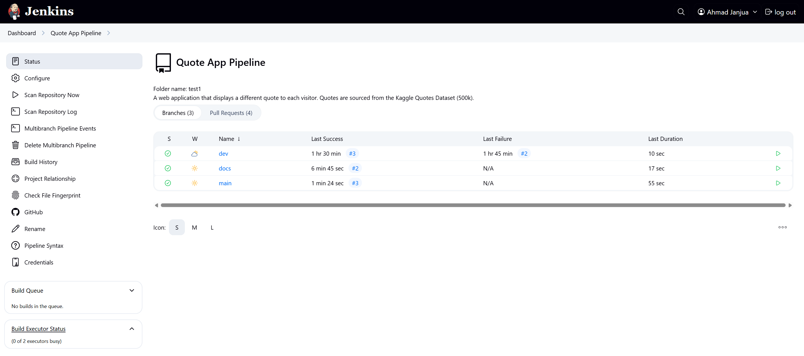

# Quote Viewer Web App with CI/CD

A web application built with **Next.js** that serves quotes from a PostgreSQL database.

This project emphasizes DevOps practices such as **containerization**, **CI/CD automation**, and **multi-architecture image deployment**.

## Overview

The primary goal of this project is not the application logic, but the end-to-end setup of development, testing, and deployment pipelines using modern **DevOps** tools.




The app connects to a database populated with quotes from the [Kaggle Quotes Dataset (500k)](https://www.kaggle.com/datasets/manann/quotes-500k).
Each visitor to the site is shown a quote corresponding to a global index stored in the database, which is incremented with every visit.


---

## Features

* PostgreSQL-backed quote database
* Index-based quote serving with update logic
* Server-side API handling via Next.js
* Unit tests written with Jest and JUnit reporting
* Dockerized development and production environments
* Multi-architecture Docker images (linux/amd64, linux/arm64)
* Jenkins-based CI/CD pipeline
* Automatic deployment to a Raspberry Pi server from main branch

---

## Project Workflow

### 1. Database Setup

* Created and configured a PostgreSQL instance
* Cleaned and imported the Kaggle dataset using SQL scripts
* Defined roles, permissions, and schema

### 2. Web Application

* Developed a Next.js app with:

  * API route to fetch and increment the index
  * UI to display quotes retrieved from the database

### 3. Testing and Reporting

* Added unit tests using **Jest**
* Integrated **JUnit** format test reports for CI visibility

### 4. Docker and Containerization

* Built Docker containers for both the app and database
* Used Docker Compose to:

  * Establish a shared network
  * Persist database state via volumes
  * Expose application port to the host
* Created and pushed **multi-architecture** Docker images to Docker Hub

### 5. Jenkins CI/CD Pipeline

* Ran Jenkins in a Docker container with access to the host Docker daemon
* Implemented a multibranch pipeline with the following behavior:

| Branch Type    | Pipeline Actions                             |
| -------------- | -------------------------------------------- |
| `main` commits | Lint → Test → Build → Deploy to Raspberry Pi |
| `main` PRs     | Lint → Test → Build                          |
| Other branches | Lint → Test                                  |


---

## Technology Stack

* **Next.js**
* **Jest + JUnit reporting**
* **PostgreSQL**
* **Docker & Docker Compose**
* **Jenkins (Multibranch Pipeline)**
* **Raspberry Pi (ARM64 target)**

---

## Local Development

Must have docker installed.

```bash
# Clone the repository
git clone https://github.com/AhmadJanjua/DevOps-Quote-App
cd DevOps-Quote-App

# Build and start the containers
docker compose up --build
```

---

## Future Work
* Explore container orchestration (e.g., Kubernetes)

---
